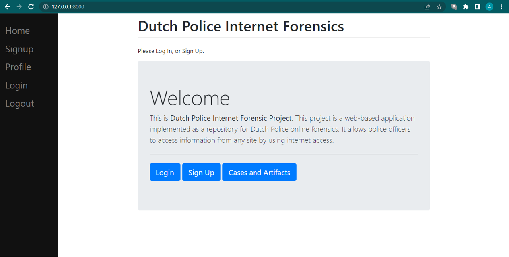
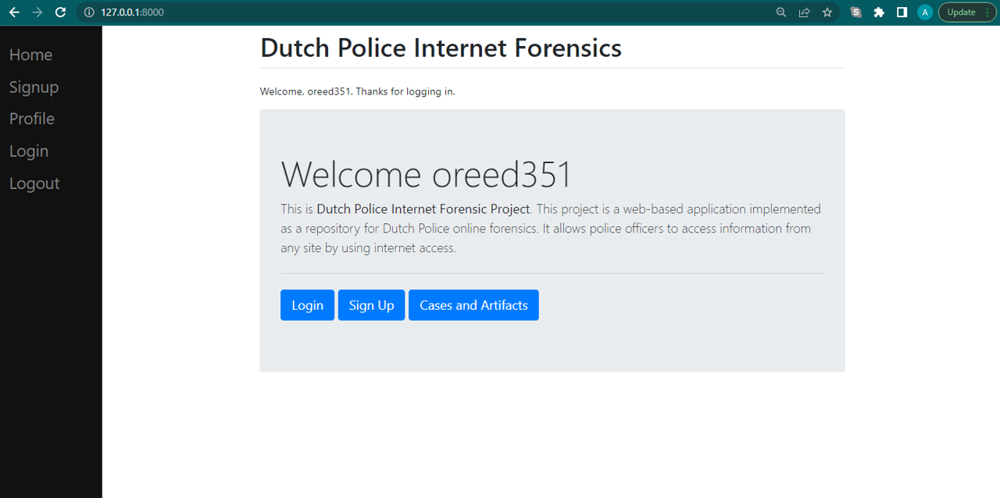
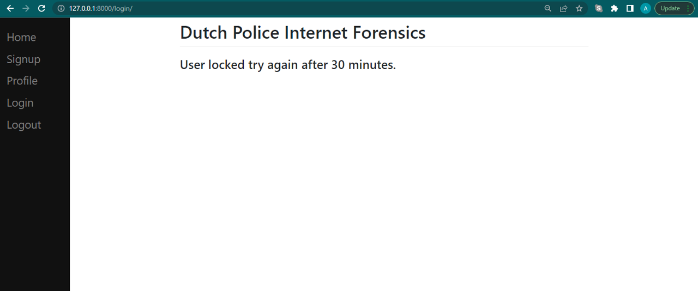

# Dutch Police App

This is Dutch Police Internet Forensic Project. This project is a web-based application implemented as a repository for Dutch Police online forensics. It allows police officers to access information from any site by using internet access.



## Project Considerations

This project was built using:
- Python 3.10+
- django framework
- Pycharm community edition
- Windows 10
- MySql database management system

## Installing and running the application

1. Download or unzip contents of dutch police app.
2. It is recommended to create virtual environment.
```bash
pip install virtualenv
python -m virtualenv venv
.\venv\Scripts\activate
```
3. From root folder in terminal run the next instruction to install all required packages listed in the "requirements.txt" document.
```bash
pip install -r requirements.txt
```
4. Install mysql
    1. Download Windows (x86, 32-bit), MSI Installer from:
    https://dev.mysql.com/downloads/installer/
    3. Refer to the mysql windows 10 installation guide from:
    https://cloudinfrastructureservices.co.uk/how-to-install-mysql-server-on-windows-10/
5. Setting up mysql database.
    1. Start mysql shell by running next command on terminal and enter local host password:
    ```bash
    mysql -u root -p
    ```
    2. Create database "dutch" on local host.
    ```bash
    mysql> CREATE DATABASE dutch
    ```
    3. Type exit to quit mysql shell.
    ```bash
    mysql> exit
    ```
    4. Confirm settings on ".\pythonProject\testNew\testNew\settings.py"
    ```python
    DATABASES = {
        'default': {
            #'ENGINE': 'django.db.backends.sqlite3',
            #'NAME': BASE_DIR / 'db.sqlite3',
            'ENGINE': 'django.db.backends.mysql',
            'NAME': 'dutch',
            'USER':'root',  # Update this field if different to local host configuration
            'PASSWORD':'Dutchpif2022',  # Update this field if different to local host configuration
            'HOST':'localhost',
            'PORT':'3306'
        }
    }
    ```
6. On terminal go to the "testNew" folder (cd testNew) and run next commands on terminal:
    1. Run the makemigrations command to match the models on the database with the ones defined on "models.py". This will create all the necessary tables used by the project.
    ```bash
    python manage.py makemigrations testApp
    ```
    2. Database schema changes are recorded on the migations folder. Each time changes are made to database a sequential file is generated. Run the sqlmigrate command to specify changes to be applied to database.
    ```bash
    python manage.py sqlmigrate testApp 0001
    ```
    3. Run the migrate command to apply the specified changes to the database.
    ```bash
    python manage.py migrate testApp
    ```
8. Create super user for being able to perform administrative functions. Enter any username and password.
```bash
python manage.py createsuperuser
```
9. Run the application.
```bash
python manage.py runserver
```
10. For accessing "Dutch Police Internet Forensics" web page use the next link:
```bash
http://127.0.0.1:8000/
```
12. For accessing "Dutch Police Internet Forensics" administrative configuration:
```bash
http://127.0.0.1:8000/admin
```

## Access Levels

The application has three different roles with different access levels, the following are the actions allowed for each level and the credentials to test their access:

Role          | Investigator
------------- | -------------
Actions       | Create Case, view case, delete case, add FIR.
Restrictions  | Cannot access Admin
Credentials   | username: baba, password: AprMay$$129

Role          | Police Officer
------------- | -------------
Actions       | View Case, modify profile.
Restrictions  | Cannot access Admin
Credentials   | username: simon.green, password: JunJul$$1290 


Role          | Admin Officer
------------- | -------------
Actions       | Register User, Admin page access, reset password, Lock/Unlock User
Restrictions  | None
Credentials   | username: baba, password: AprMay$$129

Test output is available in the file "ReadMe_TestOutput.docx"

## Login to the App and User Logging Validation
Depending on user permissions, user can log to the adming configuration page or to the Dutch Police website.

- Login to the Admin configuration page.


- Login to the website.


- If user logging is succesful. logging successful message is displayed.


- User has up to 5 attempts to log into the application. When incorrect password or user is entered message is displayed on the top.


- After 5 attempts user is locked for 30 minutes.


- Logging attempts and locked time is cofigured on the settings.py file.


## Password sign up and password update validation.
When creating password for a new user, password validation is performed to ensure that new password adheres to security standards.

- Character length validation.


- Username similarity validation.


- Email similarity validation.


- Password too common validation.


Same validations are performed when updating password for existing user.

- Character length validation.


- Password too common and entirely numeric validation.


- Incorrect old password.


All stored passwords are encrypted using argon2 hasher library so attackers cannot get acces to raw password even if they get access to the database. Next image shows how passwords are hasshed for existing users.


## User permissions validation.
As mentioned before, users can perform different actions depending on the permissions they are given.

- Investigator or Police Officer cannot access to Administration Configuration page.


- Police Officers can view existing cases, but they cannot Add New Record, edit or delete them.
    - Attempting to add new record.
    
    - Viewing case details.
    

- Artifacts or images stored for each case are encrypted before storign them into the database, so information about them cannot be viewed even if attacker gets access to the DB.


- Admin Officers:

